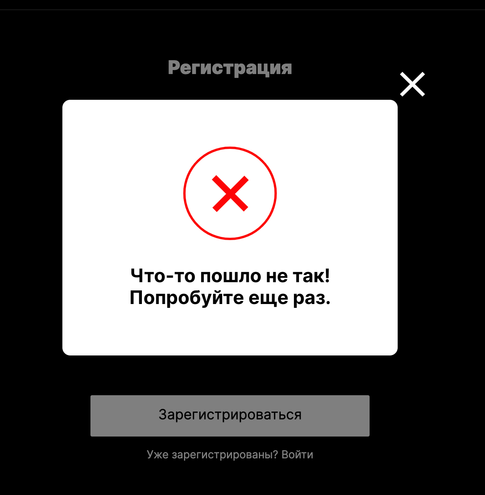
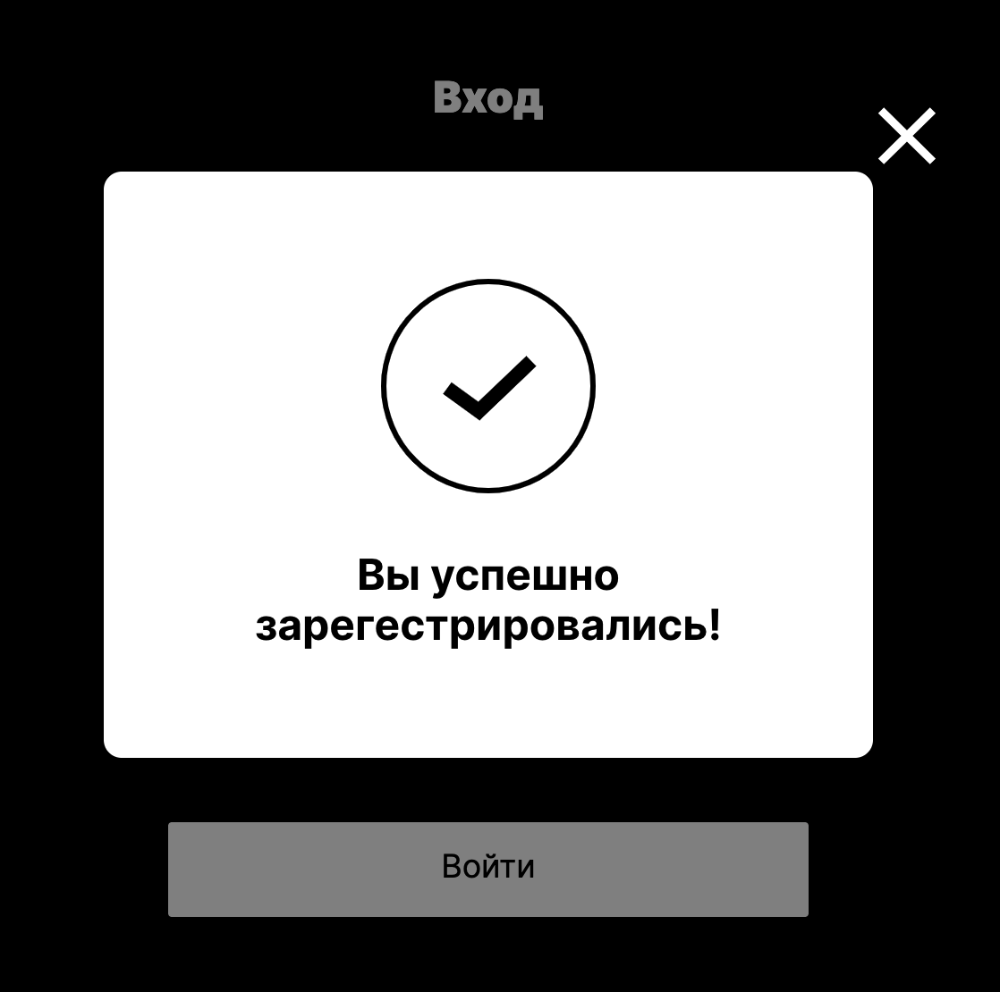
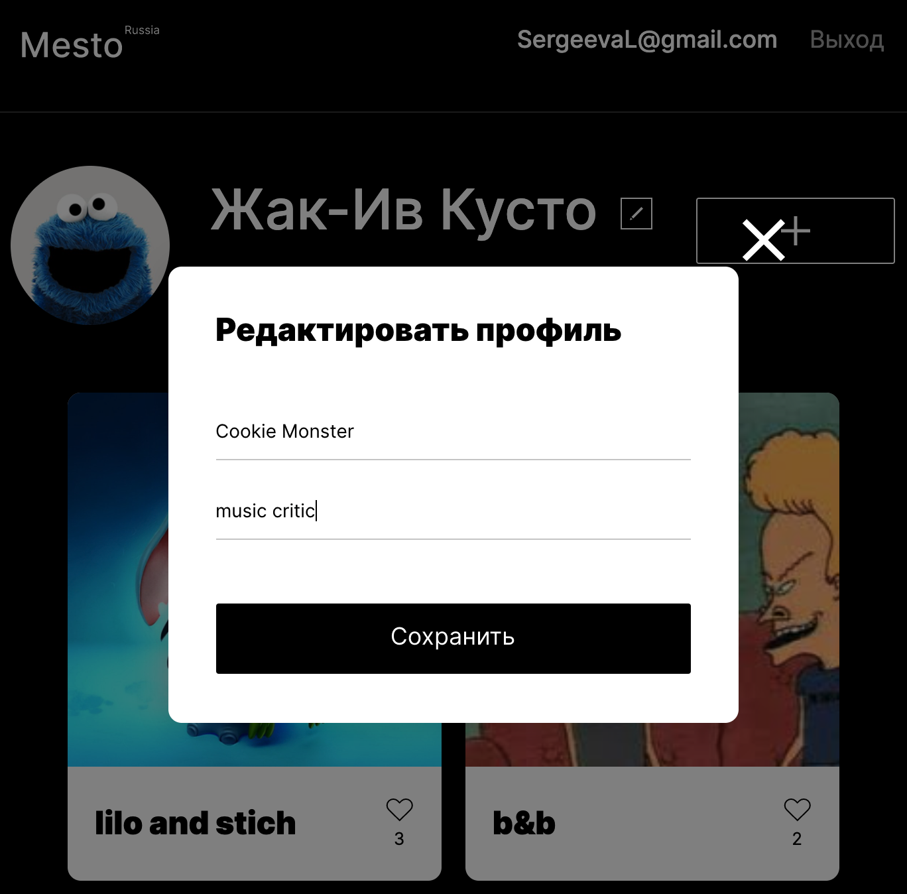
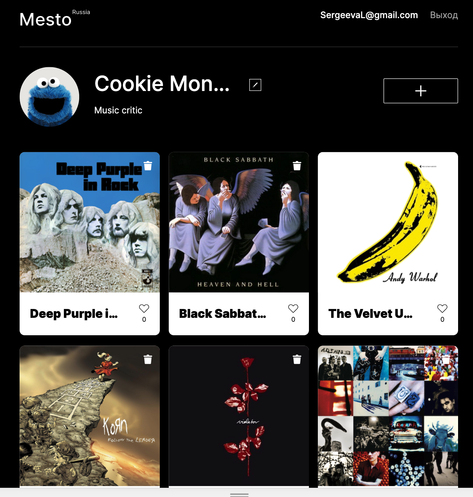

# MESTO

## Study project at Practicum by Yandex

It is a full-stack single page application to allow users to upload, view, like and delete photos.

To use the service user need to register himself and to login.

### :arrow_right: Links to test

Backend https://mesto-react.herokuapp.com  
Frontend https://mesto-react-front.herokuapp.com

### :hammer_and_pick: Technologies were used

- JavaScript ES6 - object-oriented programming, fetch API (GET, PUT, DELETE, POST, PATCH)

- React.js (functional and class components, Context, Ref, Redirect, Route, Switch functions etc.),

- semantic HTML5, styles - CSS3 (Flexbox, Grid, adaptive layout),

- JSX,

- BEM - Block Element Modifier is a methodology,

- React hooks (useState, useEffect, useContext, useRef, useHistory),

- Create React App build,

- Node.js, Express.js - API based on REST principles for working with the database, authentication/authorization,

- MongoDb, Mongoose - schema,

- Yandex.Cloud service Virtual Machine, Heroku PAAS,

- Client-side and user-side validation, joi/celebrate modules, jwt-token,

- BodyParser, DotENV, bCrypt, Nodemon,

- Access and error logs are maintained using the winston module,

- Centralized error handling with sending correct statuses and error messages to requests,

- ESLint airbnb-base,

- Figma, Pixel perfect,

- Git versions, branches.

### Preview

